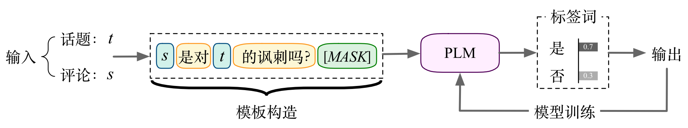

# Introduction

[Dataset (ToSarcasm)](#tosarcasm) and [Code (TOSPrompt)](#tosprompt) for CCL 2022 best paper: *[面向话题的讽刺识别:新任务、新数据和新方法(Topic-Oriented Sarcasm Detection: New Task, New Dataset and New Method)](https://aclanthology.org/2022.ccl-1.50/)*

Bin Liang (梁斌), Zijie Lin (林子杰), Bing Qin (秦兵), Ruifeng Xu* (徐睿峰)

# ToSarcasm
This is a chinese dataset for topic-oriented sarcasm detection. The form of each sample is:
```text
{
  'topic': '美国两党被曝都曾花钱挖特朗普黑料', 
  'text': '真的很优秀',
  'label': '1'
}
```
where `0-非讽刺(non-sarcasm)`, `1-讽刺(sarcasm)`. 

:star: We have relabeled the data, and the statistical information of re-labeled dataset is as follows:

| ToSarcasm | Train  |  Dev  |  Test  |
| :---: | :--: | :--: | :---: |
|  Sarcasm  | 1608 | 678 | 623 |
|  Non-Sarcasm  | 1317 | 295 | 350 |
| All | 2925 | 973 | 973 |

For more details on the dataset please see the [paper](https://aclanthology.org/2022.ccl-1.50/).

# TOSPrompt
A prompt-based approach for topic-oriented sarcasm detection.



## Dependencies

* Python 3.7.10
* PyTorch 1.11.0
* transformers 4.18.0
* OpenPrompt 0.1.1


## Getting Start

You can easily clone this project via:

```bash
git clone https://github.com/HITSZ-HLT/ToSarcasm.git
cd ToSarcasm
```

Then, create a runnable conda environment via:
```bash
conda env create -f environment.yml
source activate && conda activate tosprompt
```

## Data

We evaluate our model on our proposed dataset ToSarcasm.

The data for experiment are placed in `./data/`.


## Train & Test

```bash
python run_prompt.py \
--do_train \
--do_eval \
--epoch 6 \
--batch_size 32 \
--max_length 256 \
--lr 2e-5 \
--weight_decay 2e-3 \
--data_path ./data/ \
--seeds 42 \
--gpu_id 0
```
if you are running in a non-cuda environment, you can set `--gpu_id -1` to run with cpu.

# Citation
```text
@inproceedings{liang-etal-2022-mian,
    title = "面向话题的讽刺识别:新任务、新数据和新方法(Topic-Oriented Sarcasm Detection: New Task, New Dataset and New Method)",
    author = "Liang, Bin  and
      Lin, Zijie  and
      Qin, Bing  and
      Xu, Ruifeng",
    booktitle = "Proceedings of the 21st Chinese National Conference on Computational Linguistics",
    year = "2022",
    url = "https://aclanthology.org/2022.ccl-1.50",
    pages = "557--568"
}
```
